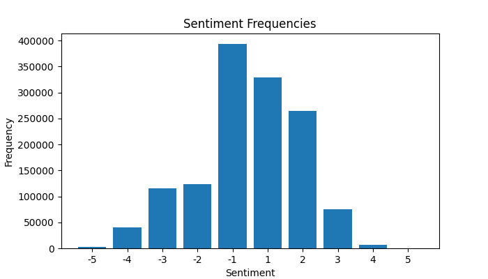

## Template Report: AI for Global Health using Natural Language Processing

### Part 1: Data pre-processing

**Q1: Preprocessing (2 pt)** <br> 
As a first step we remove all rows, which have NaN entries in the 'TweetText' column of the data.
After that we remove URLs, emojis and punctuation.
In the process of tokenization, mentions are removed, all characters are converted to lower case and repeated sequences of characters of length 3 or greater are reduced to length 3.
The last step is lemmatization, for which we use the WordNetLemmatizer from the nltk library.

Irregular capitalization is handled by converting every letter to lowercase.
Lemmatization alleviates the problem of variable declinations by mapping them to the same word which captures the semantics.
Punctuation, URLs, mentions, emojis and punctuation are removed.
Some of theses symbols carry information for our task, for example emojis, but in keeping them the vocabulary of our model would become significantly larger.
Abbreviations and spelling mistakes pose a much harder problem.
Although we argue that in most cases the sentiment of the tweet can already be deduced without considering these.
Hence we do not implement any preprocessing method to counter them.
**[Code snippet]**
```
def remove_nans(data):

    return data[data['TweetText'].notnull()]

def remove_url(tweet):

    # remove hyperlinks
    return re.sub(r'(https?:\/\/(?:www\.|(!www))[a-zA-Z0-9][a-zA-Z0-9-]+[a-zA-Z0-9]\.[^\s]{2,}|https?:\/\/(?:www\.|(?!www))[a-zA-Z0-9]\.[^\s]{2,}|www\.[a-zA-Z0-9]\.[^\s]{2,})', '', tweet)

def remove_emojis(tweet):

    # remove emojis
    # source: https://stackoverflow.com/questions/33404752/removing-emojis-from-a-string-in-python
    emoji_pattern = re.compile("["
        u"\U0001F600-\U0001F64F"  # emoticons
        u"\U0001F300-\U0001F5FF"  # symbols & pictographs
        u"\U0001F680-\U0001F6FF"  # transport & map symbols
        u"\U0001F1E0-\U0001F1FF"  # flags (iOS)
        u"\U00002500-\U00002BEF"  # chinese char
        u"\U00002702-\U000027B0"
        u"\U00002702-\U000027B0"
        u"\U000024C2-\U0001F251"
        u"\U0001f926-\U0001f937"
        u"\U00010000-\U0010ffff"
        u"\u2640-\u2642" 
        u"\u2600-\u2B55"
        u"\u200d"
        u"\u23cf"
        u"\u23e9"
        u"\u231a"
        u"\ufe0f"  # dingbats
        u"\u3030"
                      "]+", re.UNICODE)
    return re.sub(emoji_pattern, '', tweet)

def remove_punctuation(tweet):

    # remove punctuation
    return tweet.translate(str.maketrans('', '', string.punctuation))

def tokenization(tweets):

    tokenized_tweets = []
    # preserve case = False => convert to lowercase
    # strip_handles = True => remove @mentions
    # reduce_len = True => reduce length of repeated characters
    tokenizer = TweetTokenizer(preserve_case=False, strip_handles=True, reduce_len=True)

    for tweet in tweets:
        tokenized_tweets.append(tokenizer.tokenize(tweet))

    return tokenized_tweets

def lemmatization(tweets):

    lemmatized_tweets = []

    lemmatizer = WordNetLemmatizer()

    for tweet in tweets:
        lemmatized_tweets.append([lemmatizer.lemmatize(word) for word in tweet])

    return lemmatized_tweets
```

**Q2: Exploratory data analysis (1 pts)** <br>
The following plots show the 10 most common unigrams and bigrams before and after preprocessing.




**[Quantitative analysis & Question answer]**


From this bar plot we can see that the expression 'lol' is the most commonly used token followed by a set of connection word with low semantic content. 
### Part 2: NLP learning based approaches for sentiment analysis


Q1: **[What are the methods used ?]** The VADER approach tackles the analysis of sentiments through ... 

**[Code snippet]**
```
def vader(mytweet):
    mylabels = f_vader(mytweet)    # customize based on chosen appraoch
    return mylabels
```

**[Quantitative analysis & Question answer]** Using the VADER method, our test accuracy reached ... 