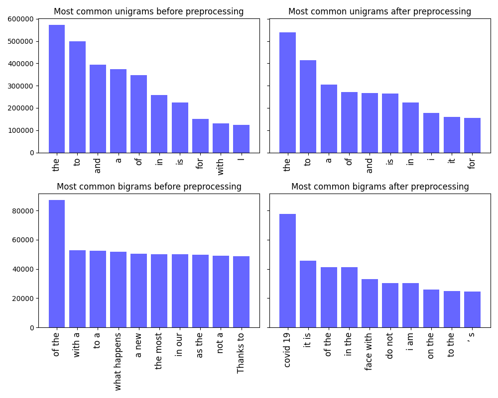
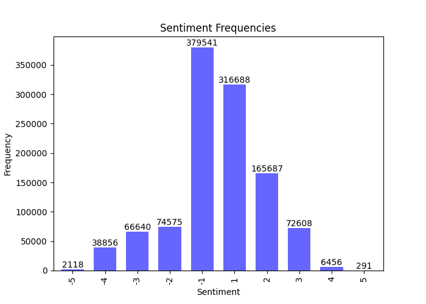
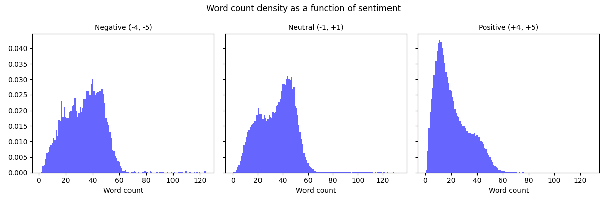

## AI for Global Health using Natural Language Processing

### Part 1: Data pre-processing

TODO: Remove duplicate rows. <br>
TODO: Convert emoticons to text. <br>
TODO: Correct spelling mistakes. <br>

**Q1: Preprocessing (2 pt)** <br> 
As a first step we remove all rows, which have NaN entries in the 'TweetText' column of the data.
Then we remove all duplicate rows.
After that we remove URLs, emojis and punctuation.
In the process of tokenization, mentions are removed, all characters are converted to lower case and repeated sequences of characters of length 3 or greater are reduced to length 3.
The last step is lemmatization, for which we use the WordNetLemmatizer from the nltk library.
Furthermore we remove duplicate rows, in this way we get rid of around 110k rows.

Irregular capitalization is handled by converting every letter to lowercase.
Lemmatization alleviates the problem of variable declinations by mapping them to the same word which captures the semantics.
Punctuation, URLs, mentions, emojis and punctuation are removed.
Some of theses symbols carry information for our task, for example emojis, but in keeping them the vocabulary of our model would become significantly larger.
Abbreviations and spelling mistakes pose a much harder problem.
Although we argue that in most cases the sentiment of the tweet can already be deduced without considering these.
Hence we do not implement any preprocessing method to counter them.
**[Code snippet]**
```
def remove_nans(data):

    return data[data['TweetText'].notnull()]

def remove_url(tweet):

    # remove hyperlinks
    # source: https://github.com/vasisouv/tweets-preprocessor/blob/master/twitter_preprocessor.py
    return re.sub(r'(https?:\/\/(?:www\.|(!www))[a-zA-Z0-9][a-zA-Z0-9-]+[a-zA-Z0-9]\.[^\s]{2,}|https?:\/\/(?:www\.|(?!www))[a-zA-Z0-9]\.[^\s]{2,}|www\.[a-zA-Z0-9]\.[^\s]{2,})', '', tweet)

def remove_emojis(tweet):

    # remove emojis
    # source: https://stackoverflow.com/questions/33404752/removing-emojis-from-a-string-in-python
    emoji_pattern = re.compile("["
        u"\U0001F600-\U0001F64F"  # emoticons
        u"\U0001F300-\U0001F5FF"  # symbols & pictographs
        u"\U0001F680-\U0001F6FF"  # transport & map symbols
        u"\U0001F1E0-\U0001F1FF"  # flags (iOS)
        u"\U00002500-\U00002BEF"  # chinese char
        u"\U00002702-\U000027B0"
        u"\U00002702-\U000027B0"
        u"\U000024C2-\U0001F251"
        u"\U0001f926-\U0001f937"
        u"\U00010000-\U0010ffff"
        u"\u2640-\u2642" 
        u"\u2600-\u2B55"
        u"\u200d"
        u"\u23cf"
        u"\u23e9"
        u"\u231a"
        u"\ufe0f"  # dingbats
        u"\u3030"
                      "]+", re.UNICODE)
    return re.sub(emoji_pattern, '', tweet)

def remove_punctuation(tweet):

    # remove punctuation
    return tweet.translate(str.maketrans('', '', string.punctuation))

def tokenization(tweets):

    tokenized_tweets = []
    # preserve case = False => convert to lowercase
    # strip_handles = True => remove @mentions
    # reduce_len = True => reduce length of repeated characters
    tokenizer = TweetTokenizer(preserve_case=False, strip_handles=True, reduce_len=True)

    for tweet in tweets:
        tokenized_tweets.append(tokenizer.tokenize(tweet))

    return tokenized_tweets

def lemmatization(tweets):

    lemmatized_tweets = []

    lemmatizer = WordNetLemmatizer()

    for tweet in tweets:
        lemmatized_tweets.append([lemmatizer.lemmatize(word) for word in tweet])

    return lemmatized_tweets
```

**Q2: Exploratory data analysis (1 pts)** <br>
The following plots show the 10 most common unigrams and bigrams before and after preprocessing.


After preprocessing the unigram 'the' has a higher frequency than before preprocessing.
This makes sense since everything is converted to lowercase. 
Interestingly the bigram 'covid 19' has the second highest frequency after preprocessing, but does not show up in the top 10 before preprocessing.
This is due to the fact that 'covid19' is split into two tokens 'covid' and '19' during our tokenization.

The following plot shows how often each sentiment occurs in the dataset.

The distribution of the sentiments is very skewed.
The majority of the tweets are neutral, with a tendency towards positive sentiments.
Although we can see that there are much more very negative tweets (-4 and -5) than very positive tweets (4 and 5).

Inspecting the distribution of the word counts of the tweets, we notice that the neutral and negative tweets have similar distributions, while the positive tweets have a very different distribution.
Positive tweets tend to be much shorter than neutral and negative tweets.


**Q3: Metric Choice (1 pt)** <br>
The classes are not balanced, so we will use balanced accuracy and the weighted f1 score as metrics.

**[Code snippet]**
```
from sklearn.metrics import f1_score, balanced_accuracy_score
f1 = f1_score(y_true, y_pred, average='weighted')
balanced_accuracy = balanced_accuracy_score(y_true, y_pred)
```

**Q4: Dataset splitting (1 pt)** <br>
Since the dataset is very large with nearly 700k tweets we can afford a 80/10/10 split.
The validation and test datasets will still contain nearly 70k tweets each, which should give us a good estimate of the general performance of our model. 
We take care to shuffle the dataset before splitting it, since the tweets are ordered by date. 
Furthermore we make sure to keep the class distribution as in the original dataset by propagating the 80/10/10 split to each combination of positive and negative sentiment.

TODO: Possible Evaluation Challenges

### Part 2: NLP learning based methods (45 pts)

### VADER (5 pts)

TODO: Add stuff from Chris

### Word Embeddings (20 pts)

**Q1: Bag of Words (2 pts)** <br>

The Bag of Words method establishes the number of occurrences of each word in the dataset and keeps the top n words.
The columns of the feature map are then the top n words and the rows are the tweets.
Each cell then contains the number of occurrences of the word in the corresponding tweet.

**[Code snippet]**
```
from sklearn.feature_extraction.text import CountVectorizer

vectorizer = CountVectorizer(max_features=1000)
X = vectorizer.fit_transform(data['TweetText']).toarray()
```
We use the count vectorizer of the sklearn library to create the feature map with the Bag of Words method.

**Q2: TF-IDF (2 pts)** <br>

In this method, first for each document (or tweet in our case) we calculate the term frequency ($TF$) of each word in the document.
For a given word $w$ and document $d$ the $TF$ score is given by
$$ 
TF(w, d) = count(w,d) / |d|,$$
where $count(w,d)$ is the number of occurrences of $w$ in $d$ and $|d|$ is the number of words in $d$.
The TF score tries to capture the importance of a word in a single document.

The second score of the method is the IDF.
Here we first calculate the inverse document frequency for each word in the dataset.
That is for each word we divide the number of all documents in the dataset by the total number of documents containing the word.
As this inverse score might become very big we apply the logarithm.
For a given word $w$ and dataset $D$ the IDF score is given by
$$
\begin{aligned}
IDF(w, D) = log\left(\frac{|D|}{|d \in D : w \in d| + 1}\right),
\end{aligned}
$$
where $|D|$ is the total number of documents and $|d \in D : w \in d|$ is the number of documents containing $w$.
In contrast to the $TF$, the $IDF$ measures the importance across documents in the whole dataset.

The final score is then given by combining $TF$ and $IDF$,
$$
TF\text{-}IDF(w, d, D) = TF(w, d) * IDF(w, D).
$$

Again we use the sklearn library to calculate the scores.
In order to get a tractable feature matrix, we again restrict the method to the 1000 words with the highest $TF$ across the whole document. <br>
**[Code snippet]**
```
from sklearn.feature_extraction.text import TfidfVectorizer

vectorizer = TfidfVectorizer(max_features=1000)
X = vectorizer.fit_transform(data['TweetText'])
```

**Q4: GloVe (2 pts)** <br>

GloVe uses relies on the occurrence matrix $V$.
This matrix has the words of the vocabulary as rows and columns.
Each cell $V_{ij}$ contains the number of times word $i$ has co-occurred with word $j$ in the dataset.

Now we can model the probability of word $i$ occurring with word $j$ as
$$
P_{ij} = \frac{V_{ij}}{V_i},
$$
where $V_i$ is the number of times word $i$ has occurred in the dataset.
Now we introduce two matrices $U, W$ in order to model $P_{ij}$ with
$$
\hat{P}_{ij} = \exp(w_i^T u_j).
$$
So we end up with two vectors $u_i, w_i$ for each word $i$.
The idea is find $U, W$ such that each $\hat{P}_{ij}$ is close to $P_{ij}$.
After applying some further steps, one can then define a loss function for optimizing $U, W$ and some bias $b$. <br>
**[Code snippet]**
```
glove_embeddings = {}
with open("embeddings/glove.twitter.27B.200d.txt", 'r') as f:
    for line in f:
        values = line.split()
        word = values[0]
        vector = np.asarray(values[1:], "float32")
        glove_embeddings[word] = vector
```
**Q5: FastText (2 pts)** <br>

FastText uses a CBOW model to learn word embeddings.
But there are several improvements.
Position vectors are introduced for each word in the context.
In order to encode positional information they are multiplied point wise with each word vector in the surrounding of the source word.
Furthermore with certain probability unigrams are merged based on their mutual information.
This is done 5-6 times to get more informative phrases.
Another feature is the use of subword information.
Each word is decomposed into character n-grams and their representations are learned as well.
Finally their average is added to the word vector
(Bojanowski et al., <em> Advances in Pre-Training Distributed Word Representations </em>, 2018). <br>

We download a set of word vectors, trained on Wikipedia 2017, UMBC webbase corpus and statmt.org news dataset (16B tokens) from the fasttext website.

**[Code snippet]**
```
import io

def load_vectors(fname):
    fin = io.open(fname, 'r', encoding='utf-8', newline='\n', errors='ignore')
    n, d = map(int, fin.readline().split())
    data = {}
    for line in fin:
        tokens = line.rstrip().split(' ')
        data[tokens[0]] = np.asarray(tokens[1:], dtype=np.float16)
    return data

ft_embeddings = load_vectors('embeddings/wiki-news-300d-1M-subword.vec')
```
