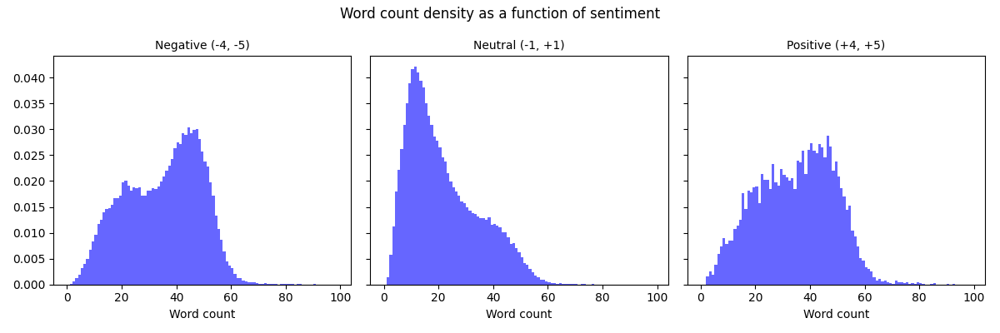

## Template Report: AI for Global Health using Natural Language Processing

### Part 1: Data pre-processing

**Q1: Preprocessing (2 pt)** <br> 
As a first step we remove all rows, which have NaN entries in the 'TweetText' column of the data.
After that we remove URLs, emojis and punctuation.
In the process of tokenization, mentions are removed, all characters are converted to lower case and repeated sequences of characters of length 3 or greater are reduced to length 3.
The last step is lemmatization, for which we use the WordNetLemmatizer from the nltk library.

Irregular capitalization is handled by converting every letter to lowercase.
Lemmatization alleviates the problem of variable declinations by mapping them to the same word which captures the semantics.
Punctuation, URLs, mentions, emojis and punctuation are removed.
Some of theses symbols carry information for our task, for example emojis, but in keeping them the vocabulary of our model would become significantly larger.
Abbreviations and spelling mistakes pose a much harder problem.
Although we argue that in most cases the sentiment of the tweet can already be deduced without considering these.
Hence we do not implement any preprocessing method to counter them.
**[Code snippet]**
```
def remove_nans(data):

    return data[data['TweetText'].notnull()]

def remove_url(tweet):

    # remove hyperlinks
    # source: https://github.com/vasisouv/tweets-preprocessor/blob/master/twitter_preprocessor.py
    return re.sub(r'(https?:\/\/(?:www\.|(!www))[a-zA-Z0-9][a-zA-Z0-9-]+[a-zA-Z0-9]\.[^\s]{2,}|https?:\/\/(?:www\.|(?!www))[a-zA-Z0-9]\.[^\s]{2,}|www\.[a-zA-Z0-9]\.[^\s]{2,})', '', tweet)

def remove_emojis(tweet):

    # remove emojis
    # source: https://stackoverflow.com/questions/33404752/removing-emojis-from-a-string-in-python
    emoji_pattern = re.compile("["
        u"\U0001F600-\U0001F64F"  # emoticons
        u"\U0001F300-\U0001F5FF"  # symbols & pictographs
        u"\U0001F680-\U0001F6FF"  # transport & map symbols
        u"\U0001F1E0-\U0001F1FF"  # flags (iOS)
        u"\U00002500-\U00002BEF"  # chinese char
        u"\U00002702-\U000027B0"
        u"\U00002702-\U000027B0"
        u"\U000024C2-\U0001F251"
        u"\U0001f926-\U0001f937"
        u"\U00010000-\U0010ffff"
        u"\u2640-\u2642" 
        u"\u2600-\u2B55"
        u"\u200d"
        u"\u23cf"
        u"\u23e9"
        u"\u231a"
        u"\ufe0f"  # dingbats
        u"\u3030"
                      "]+", re.UNICODE)
    return re.sub(emoji_pattern, '', tweet)

def remove_punctuation(tweet):

    # remove punctuation
    return tweet.translate(str.maketrans('', '', string.punctuation))

def tokenization(tweets):

    tokenized_tweets = []
    # preserve case = False => convert to lowercase
    # strip_handles = True => remove @mentions
    # reduce_len = True => reduce length of repeated characters
    tokenizer = TweetTokenizer(preserve_case=False, strip_handles=True, reduce_len=True)

    for tweet in tweets:
        tokenized_tweets.append(tokenizer.tokenize(tweet))

    return tokenized_tweets

def lemmatization(tweets):

    lemmatized_tweets = []

    lemmatizer = WordNetLemmatizer()

    for tweet in tweets:
        lemmatized_tweets.append([lemmatizer.lemmatize(word) for word in tweet])

    return lemmatized_tweets
```

**Q2: Exploratory data analysis (1 pts)** <br>
The following plots show the 10 most common unigrams and bigrams before and after preprocessing.


After preprocessing the unigram 'the' has a higher frequency than before preprocessing.
This makes sense since everything is converted to lowercase. 
Interestingly the bigram 'covid 19' has the second highest frequency after preprocessing, but does not show up in the top 10 before preprocessing.
This is due to the fact that 'covid19' is split into two tokens 'covid' and '19' during our tokenization.

The following plot shows how often each sentiment occurs in the dataset.

The distribution of the sentiments is very skewed.
The majority of the tweets are neutral, with a tendency towards positive sentiments.
Although we can see that there are much more very negative tweets (-4 and -5) than very positive tweets (4 and 5).

Inspecting the distribution of the word counts of the tweets, we notice that the neutral and negative tweets have similar distributions, while the positive tweets have a very different distribution.
Positive tweets tend to be much shorter than neutral and negative tweets.


**Q3: Metric Choice (1 pt)** <br>
The classes are not balanced, so we will use balanced accuracy and the weighted f1 score as metrics.

**[Code snippet]**
```
from sklearn.metrics import f1_score, balanced_accuracy_score
f1 = f1_score(y_true, y_pred, average='weighted')
balanced_accuracy = balanced_accuracy_score(y_true, y_pred)
```

**Q4: Dataset splitting (1 pt)** <br>
Since the dataset is very large with nearly 700k tweets we can afford a 80/10/10 split.
The validation and test datasets will still contain nearly 70k tweets each, which should give us a good estimate of the general performance of our model. 
We take care to shuffle the dataset before splitting it, since the tweets are ordered by date. 
Furthermore we make sure to keep the class distribution as in the original dataset by propagating the 80/10/10 split to each combination of positive and negative sentiment.

TODO: Possible Evaluation Challenges