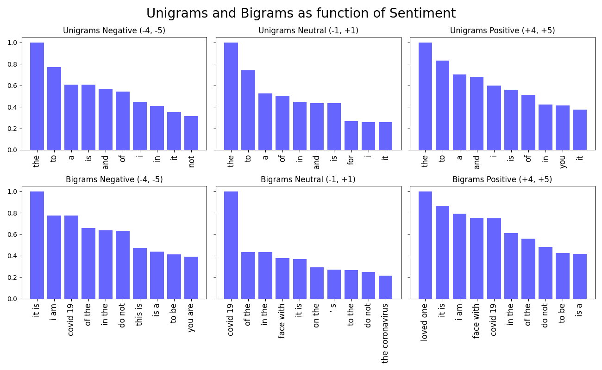
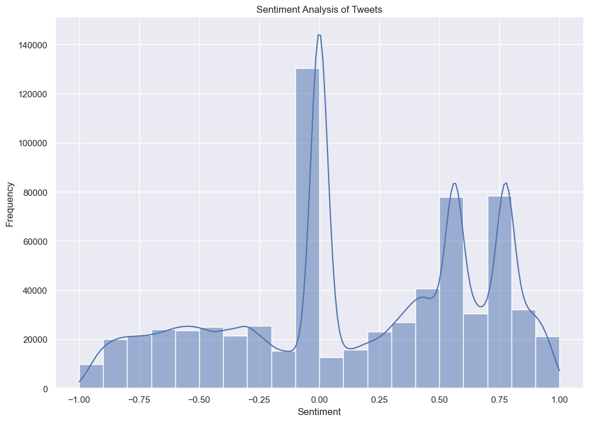
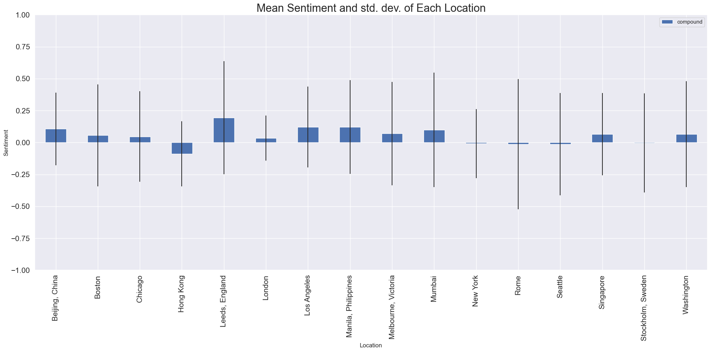
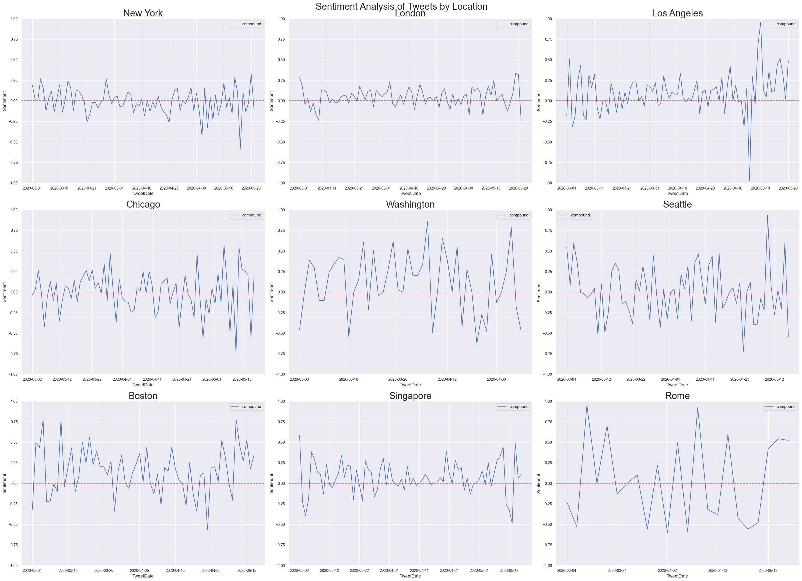
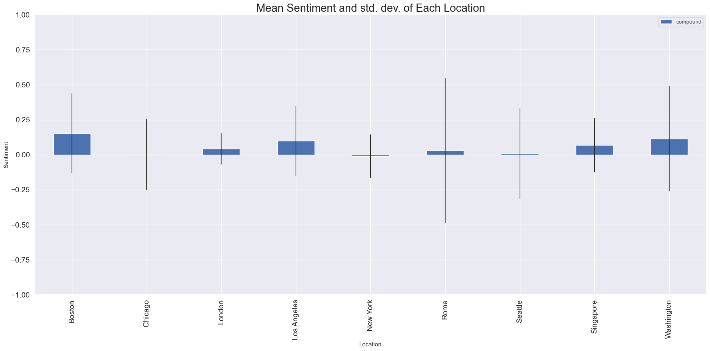
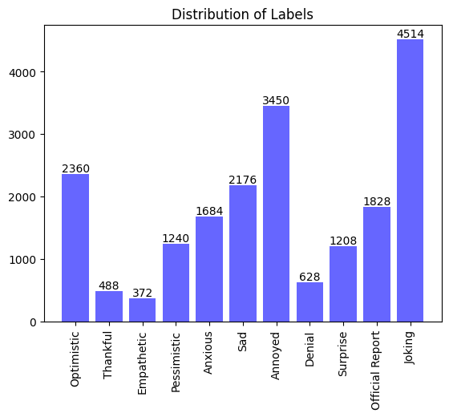
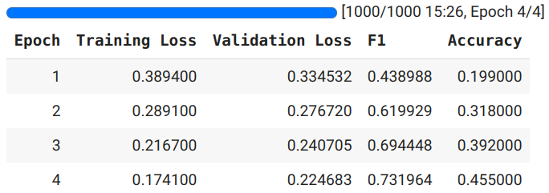
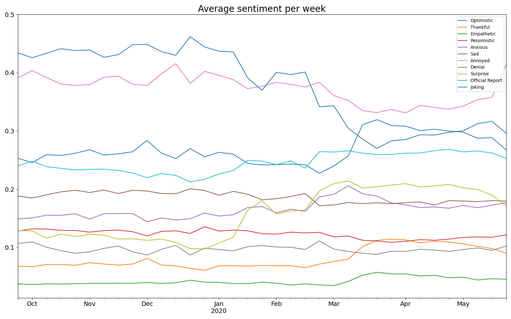
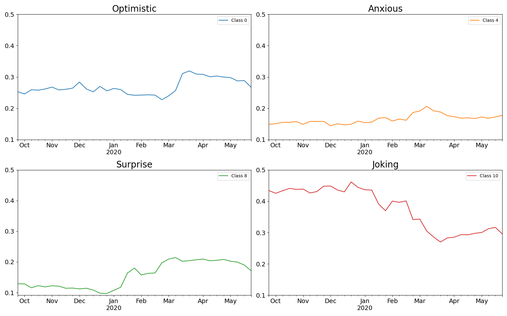

## **AI for Global Health using Natural Language Processing**

### **Part 1: Data pre-processing**

**Q1: Preprocessing (2 pt)**

As a first step we remove all rows, which have NaN entries in the 'TweetText' column of the data.
Then we remove URLs using regex. 
Further we replace emojis with their corresponding text using the emoji library.
We expand common contractions using the contractions library and remove any punctuation symbols. 
Applying the TweetTokenizer of nltk, we remove mentions, lowercase all characters and reduce repeated sequences of characters of length 3 or greater to length 3.
With the WordNetLemmatizer of nltk, we lemmatize all tweets.
As a last step we remove duplicate rows.

Irregular capitalization is handled by lowercasing.
Lemmatization alleviates the problem of variable declinations by mapping them to the same word.
Punctuation, URLs and mentions are removed.
In most cases these add no useful information.
Abbreviations and spelling mistakes do occur often in the dataset.
But we leave them be, as they can add useful information and are not as easy to handle as the other problems.
We do not remove stopwords, as they can be important for the sentiment of a tweet.

**[Code snippet]**
```
def remove_nans(data):

    return data[data['TweetText'].notnull()]

def remove_url(tweet):

    # remove hyperlinks
    # source: https://github.com/vasisouv/tweets-preprocessor/blob/master/twitter_preprocessor.py
    return re.sub(r'(https?:\/\/(?:www\.|(!www))[a-zA-Z0-9][a-zA-Z0-9-]+[a-zA-Z0-9]\.[^\s]{2,}|https?:\/\/(?:www\.|(?!www))[a-zA-Z0-9]\.[^\s]{2,}|www\.[a-zA-Z0-9]\.[^\s]{2,})', '', tweet)

def replace_emojis(tweet):

    # replace emojis with their meaning
    return emoji.demojize(tweet, delimiters=(" ", " "))

def expand_contractions(tweet):

    # expand contractions
    return contractions.fix(tweet, slang=False)

def remove_punctuation(tweet):

    # replace underscore between emoji words
    tweet = tweet.replace("_", " ")

    # do not remove @, as it is handled by the tokenizer
    punctuation = string.punctuation.replace("@", "")

    # remove punctuation
    return tweet.translate(str.maketrans('', '', punctuation))

def tokenization(tweets):

    tokenized_tweets = []
    # preserve case = False => convert to lowercase
    # strip_handles = True => remove @mentions
    # reduce_len = True => reduce length of repeated characters
    tokenizer = TweetTokenizer(preserve_case=False, strip_handles=True, reduce_len=True)

    for tweet in tweets:
        tokenized_tweets.append(tokenizer.tokenize(tweet))

    return tokenized_tweets

def lemmatization(tweets):

    lemmatized_tweets = []

    lemmatizer = WordNetLemmatizer()

    for tweet in tweets:
        lemmatized_tweets.append([lemmatizer.lemmatize(word) for word in tweet])

    return lemmatized_tweets

def remove_duplicates(data):

    # if there are duplicate of sentiment and tweet, then only keep one
    data = data.drop_duplicates(subset = ['TweetText', 'Sentiment'], keep = 'first')
    
    # if there are duplicate tweets left, that means that they have
    # different sentiments, in which case we remove them
    return data.drop_duplicates(subset = ['TweetText'], keep = False)
```

**Q2: Exploratory data analysis (1 pts)** 

The following plots show the 10 most common unigrams and bigrams before and after preprocessing.


The distribution of the unigrams is very similar before and after preprocessing.
We already see the influence of lowercasing as the unigram 'I' is replaced by 'i'.
The bigram 'covid 19' has the second highest frequency after preprocessing, but does not show up in the top 10 before preprocessing.
This is due to the fact that 'covid19' is split into two tokens 'covid' and '19' during our tokenization.



For the different sentiments, the unigram distributions are very similar.
They are dominated by common words such as "to", "the" and "a".
For the bigram distributions, we see some slight differences.
The top bigram for the positive tweets is "loved one", which is not present in the top 10 bigrams of the other sentiments.
Another notable bigram is "covid 19", which occurs more often in neutral tweets compared to negative and positive tweets.

The following plot shows how often each sentiment occurs in the dataset.


The distribution of the sentiments is very skewed.
The majority of the tweets are neutral, with a tendency towards positive sentiments.
Although we can see that there are much more very negative tweets (-4 and -5) than very positive tweets (4 and 5).

Inspecting the distribution of the word counts of the tweets, we notice that the negative and positive tweets have similar distributions, while the neutral tweets tend to be much shorter.


**Q3: Metric Choice (1 pt)**

The classes are not balanced, so we will use the class weighted f1 score as metric.
It fuses the precision and recall into one metric, this makes it especially useful for our unbalanced dataset.

**[Code snippet]**
```
from sklearn.metrics import f1_score
f1 = f1_score(y_true, y_pred, average='weighted')
```

**Q4: Dataset splitting (1 pt)**

After preprocessing we still have around 560k tweets.
This is a large amount of data so we can afford a 80/10/10 split.
The validation and test datasets will still contain 56k tweets each, which should give us a good estimate of the general performance of our model. 
We take care to shuffle the dataset before splitting it, since the tweets are ordered by date.
This already counters the issue of a potential label shift over time, as we can ensure that the training, validation and test datasets contain an equal amount tweets from all time periods.
Furthermore we make sure to keep the class distribution as in the original dataset by propagating the 80/10/10 split to each combination of positive and negative sentiment.
### **Part 2: NLP learning based methods (45 pts)**

### **VADER (5 pts)**

**Q1: Briefly explaining how this method works (1 pt).**

VADER (Valence Aware Dictionary and sEntiment Reasoner) is a freely available python package used as a lexicon and rule-based sentiment analysis tool. It is often used in context of social media based data like tweets in order to analyze a piece of text whether word/ statements made have a positive, negative or neutral sentiment. 

The VADER lexicon consists of a list of words and phrases which got sentiment ratings from 10 independent human raters who provided sentiment scores for over 9’000 token features in a range of -4 (extremely negative) to 4 (extremely positive). In this case, quality control of the ratings was ensured by keeping only lexical features which had a non-zero mean rating and standard deviations less than 2.5. As a result, VADER has a list of over 7’500 lexical token features with scores which both indicate positive or negative valence (score>0 or score<0) and the sentiment intensity of before mentioned range. For example, the word “good” has positive valence and an sentiment intensity score of 1.9.

In particular, VADER makes raw categorizations of words into positive, negative or neutral categories. When giving a sentence as input, VADER gives scores to these categories based on their ratios for proportions of text that fall in each category. As a result, the positive, negative and neutral categories should add up to 1. 

Moreover, it is important to mention that these proportions are just raw categorizations by the lexicon of each word presented in the text. These categorizations do not include the VADER rule-based enhancements such as degree modifiers, worder-order sensitivity for sentiment-laden multi-word phrases, word-shape amplifiers etc. as we will describe later. 

These rule-based enhancements are expressed in the compound score as described in the following.

In order to evaluate the sentiment of whole sentences, the compound score is computed using the sum of the valence score, adjusted according to the valence rules (e.g.: word-order sensitivity), of each word in the sentence and then normalize this sum to become a value between -1 (very negative sentiment) and +1 (very positive sentiment). Using this technique, one obtains a useful unidimensional score between -1 and +1 to evaluate the overall sentiment of whole sentences.
In the following the authors provided recommended thresholds for the interpretation of the compound score:

1. positive sentiment: compound score >= 0.05
2. neutral sentiment: (compound score > -0.05) and (compound score < 0.05)
3. negative sentiment: compound score <= -0.05

Furthermore, we would like to give examples of typical use cases/valence rules for sentiment analysis and the types of text VADER can deal with:

-	Typical negotiations (e.g.: “not good”)
-	Contractions of negations (e.g.: “wasn’t very good”)
-	Use of punctuation to show increased sentiment intensity (e.g.: ”Good!!!!!!”)
-	Use of word-shape (e.g.: “BAAAAAD” -> CAPS for words/phrases)
-	Degree modifiers to alter sentiment intensity (e.g.: intensity boosters like “very” or dampeners like “kind of”)
-	Sentiment-laden slangs (e.g.: “sux”)
-	Sentiment-laden emoticons (e.g.: “:)” or “:D”)
-	Utf-8 encoded emojis 
-	Initialisms and Acronyms (e.g.: “lol”)

As a last remark one can point out that VADER works in conjunction with NLTK as well such that VADER can do sentiment analysis on longer texts like for example decomposing paragraphs/articles etc. into sentence-level analyses.

**Q2: Provide a code snippet detailing how to use it for our task (2 pts).**

**[Code snippet]**
```
from vaderSentiment.vaderSentiment import SentimentIntensityAnalyzer

analyzer = SentimentIntensityAnalyzer()

text = "I love the course Machine Learning for Healthcare! It's amazing!"

scores = analyzer.polarity_scores(text)

print(scores)
{'neg': 0.0, 'neu': 0.482, 'pos': 0.518, 'compound': 0.8619}
```

As one can see, VADER is capable to process whole sentences by applying parts of our pre-processing steps like tokenization which seems to be not necessary anymore. 

Additionally, the overall sentence has a compound score of 0.8619 which means that the sentence has positive valence and a very high positive sentiment intensity (max.: 1).
It seems like VADER can deal with all of the raw data without pre-processing and is therefore very robust to unprocessed data. Furthermore, VADER seems to be doing fine (only errors for NaN's) and makes useful outputs which make sense even though no pre-processing was applied in our raw data.

Additionally, VADER has the advantage to make use of emoticons, UTF-8 encoded emojis, word-shapes, slangs, punctuations and initialisms/acronyms which surely helps to determine the overall sentiment more precisely. Therefore, these text types should not be removed in the pre-processing step.

**Q3: Apply this method to our TweetsCOV19 dataset and comment on the performance obtained (2 pts).**

In our evaluation of the performance of the VADER package we used the outputted compound score of the package which predicts the overall sentiment of the Tweet. As comparison, we used the labels of our dataset and summed both the positive and negative labels per Tweet to get an overall sentiment score for each Tweet.

Moreover, we will use the adjusted balanced accuracy score as a metric to evaluate the performance of the package. The adjusted balanced accuracy score is a metric that is used to evaluate the performance of a classifier. It is a balanced accuracy score that is adjusted for chance. 

As a small remark, using the adjusted balanced accuracy score, a score of 1 would mean a perfect performance, while a adjusted score of 0 would mean random guessing. Therefore, with an adjusted balance accuracy score of 0.36 VADER seems to be better than random in classifying the sentiment of twitter texts but there is still a lot of potential to be better. 

As a result, one can say that VADER is a quite good start for classifying sentiments of twitter texts but as one can see it is far away of being a perfect classifier. Reflecting on our applied methods, we used heuristics such as taking the sum of the positive and negative score from the sentiment labels in the TweetsCOV19 dataset and for example interpreted a positive sum as a positive sentiment statement. Furthermore, we applied thresholds described on the VADER GitHub page for the compound scores which helped categorizing compound scores into positive, neutral or negative predictions. 

### **Word Embeddings (20 pts)**

**Q1: Bag of Words (2 pts)**

The Bag of Words method establishes the number of occurrences of each word in the dataset and keeps the top n words.
The columns of the feature map are then the top n words and the rows are the tweets.
Each cell then contains the number of occurrences of the word in the corresponding tweet.

**[Code snippet]**
```
from sklearn.feature_extraction.text import CountVectorizer

vectorizer = CountVectorizer(max_features=1000)
X = vectorizer.fit_transform(data['TweetText']).toarray()
```
We use the count vectorizer of the sklearn library to create the feature map with the Bag of Words method.

**Q2: TF-IDF (2 pts)**

In this method, first for each document (or tweet in our case) we calculate the term frequency ($TF$) of each word in the document.
For a given word $w$ and document $d$ the $TF$ score is given by

$$TF(w, d) = count(w,d) / |d|,$$

where $count(w,d)$ is the number of occurrences of $w$ in $d$ and $|d|$ is the number of words in $d$.
The TF score tries to capture the importance of a word in a single document.

The second score of the method is the IDF.
Here we first calculate the inverse document frequency for each word in the dataset.
That is for each word we divide the number of all documents in the dataset by the total number of documents containing the word.
As this inverse score might become very big we apply the logarithm.
For a given word $w$ and dataset $D$ the IDF score is given by

$$\begin{aligned} IDF(w, D) = log\left(\frac{|D|}{|d \in D : w \in d| + 1}\right),\end{aligned}$$

where $|D|$ is the total number of documents and $|d \in D : w \in d|$ is the number of documents containing $w$.
In contrast to the $TF$, the $IDF$ measures the importance across documents in the whole dataset.

The final score is then given by combining $TF$ and $IDF$,

$$TF\text{-}IDF(w, d, D) = TF(w, d) \cdot IDF(w, D).$$

Again we use the sklearn library to calculate the scores.
In order to get a tractable feature matrix, we again restrict the method to the 1000 words with the highest $TF$ across the whole document.

**[Code snippet]**
```
from sklearn.feature_extraction.text import TfidfVectorizer

vectorizer = TfidfVectorizer(max_features=1000)
X = vectorizer.fit_transform(data['TweetText'])
```

**Q4: GloVe (2 pts)**

GloVe uses relies on the occurrence matrix $V$.
This matrix has the words of the vocabulary as rows and columns.
Each cell $V_{ij}$ contains the number of times word $i$ has co-occurred with word $j$ in the dataset.

Now we can model the probability of word $i$ occurring with word $j$ as

$$P_{ij} = \frac{V_{ij}}{V_i},$$

where $V_i$ is the number of times word $i$ has occurred in the dataset.
Now we introduce two matrices $U, W$ in order to model $P_{ij}$ with

$$\hat{P}_{ij} = \exp(w_i^T u_j).$$

So we end up with two vectors $u_i, w_i$ for each word $i$.
The idea is find $U, W$ to get the modeled probabilities as close as possible to the real probabilities.
After applying some further steps, one can then define a loss function for optimizing $U, W$ and some bias $b$.

**[Code snippet]**
```
glove_embeddings = {}
with open("embeddings/glove.twitter.27B.200d.txt", 'r') as f:
    for line in f:
        values = line.split()
        word = values[0]
        vector = np.asarray(values[1:], "float32")
        glove_embeddings[word] = vector
```

**Q5: FastText (2 pts)**

FastText uses a CBOW model to learn word embeddings.
But there are several improvements.
Position vectors are introduced for each word in the context.
In order to encode positional information they are multiplied point wise with each word vector in the surrounding of the source word.
Furthermore with certain probability unigrams are merged based on their mutual information.
This is done 5-6 times to get more informative phrases.
Another feature is the use of subword information.
Each word is decomposed into character n-grams and their representations are learned as well.
Finally their average is added to the word vector
(Bojanowski et al., <em> Advances in Pre-Training Distributed Word Representations </em>, 2018). <br>

We download a set of word vectors, trained on Wikipedia 2017, UMBC webbase corpus and statmt.org news dataset (16B tokens) from the fasttext website.

**[Code snippet]**
```
import io

def load_vectors(fname):
    fin = io.open(fname, 'r', encoding='utf-8', newline='\n', errors='ignore')
    n, d = map(int, fin.readline().split())
    data = {}
    for line in fin:
        tokens = line.rstrip().split(' ')
        data[tokens[0]] = np.asarray(tokens[1:], dtype=np.float16)
    return data

ft_embeddings = load_vectors('embeddings/wiki-news-300d-1M-subword.vec')
```

### **Transformers (20 pts)**

**Q1: Transformer-based language models (4 pts)**

Transformers can consist of a single encoder neural network (BERT), a single decoder network (GPT) or a combination of both (BART).
Encoder and decoder typically feature a stack of blocks.
Each block then of a multi-head attention layer and a feed-forward layer.
The attention mechanism is essential for the transformer architecture.
The high level idea is to learn contextualized representations of words, by attending to other words in the input sequence.
In contrast to RNNs, input sequences can be fed into transformers in parallel and not sequentially.
This allows to train them on large text corpora in an unsupervised fashion to obtain informative representations.
For the input word embeddings like GloVe or FastText can be used.

Transformer decoders or encoder-decoders are typically trained by next word prediction.
The predicted words are then fed back into the input of the decoder to build the sentence step by step.
For each word the decoder can only attend to previous words.
This is only natural, since at inference time the model has only access to its previous predictions.
To help stabilize the training, the teacher forcing method can be used.
That is for each predicted word, the word is corrected if it does not match the ground truth.

Transformer encoders can be trained by masking input tokens and then the model has to predict them.
An alternative task is next sentence prediction, where the model has to predict whether two sentences follow each other.

BERT and RoBERTa are both transformer encoders, while GPT is a transformer decoder.
RoBERTa is an optimized version of BERT, with the same architecture, but different pretraining procedure.
For example BERT uses the wordpiece tokenizer,  while RoBERTa uses the byte pair encoding tokenizer.
Furthermore RoBERTa is trained longer and on a larger corpus than BERT.
It also features longer input sequences and larger batch sizes.
In contrast to BERT, RoBERTa is trained without next sentence prediction.

GPT-3 has much more parameters (175 Billion) than BERT (345 Million) or RoBERTa (355 Million).
While BERT is fine-tuned for any task on which its performance is evaluated, GPT-3 already provides strong results without any fine-tuning.
For the input embedding GPT-3 uses byte pair encoding.
The Common Crawl dataset is used for pretraining with nearly a trillion words, which dwarves the combined 3.3 billion words of the datasets, on which BERT and RoBERTa were trained.

**Q2: Scalability (2 pts)**

TF-IDF and Bag of Words are limited in their scaling capabilities, as their representations of tweets depend on the number of words in the vocabulary.
In the other embedding methods, one can set the dimension of the embeddings vectors to a fixed size and scale to larger datasets.
However, the larger the dataset, the more different word vectors there are and thus the training time increases.

**Q3: Code (2 pts)**

We fine-tuned the BERT model, specifically the bert-base-uncased version (around 100 million parameters), for predicting the positive sentiment of a tweet.
Because of the limited computational resources, we sample the train dataset down to 5000 tweets and the validation dataset down to 625 tweets.
But for inference we let the test set unchanged.
The following code snippet shows our training configuration.
We are mostly using default configurations, with some minor changes.
As the classes are very imbalanced, we are using a class weighted cross entropy loss and subclass the trainer class for this purpose.
We do not include this in the code snippet to keep it concise.

**[Code snippet]**
```
# download pretrained model
model = AutoModelForSequenceClassification.from_pretrained("bert-base-uncased", num_labels=5).to(device)

# freeze embeddings and encoder part
for param in model.bert.embeddings.parameters():
  param.requires_grad = False
for param in model.bert.encoder.parameters():
  param.requires_grad = False

# unfreeze top layers of the encoder
for param in model.bert.encoder.layer[9].parameters():
  param.requires_grad = True
for param in model.bert.encoder.layer[10].parameters():
  param.requires_grad = True
for param in model.bert.encoder.layer[11].parameters():
  param.requires_grad = True

# gather trainable parameters
params = list(model.bert.pooler.parameters()) \
          + list(model.classifier.parameters()) \
          + list(model.bert.encoder.layer[11].parameters()) \
          + list(model.bert.encoder.layer[10].parameters()) \
          + list(model.bert.encoder.layer[9].parameters())  

# assing trainable parameters to optimizer
optim = AdamW(params=params, lr=5e-5, weight_decay=0.0)

# training arguments
training_args = TrainingArguments(output_dir="test_trainer", \
                                  evaluation_strategy="epoch", \
                                  per_device_eval_batch_size=32, \
                                  per_device_train_batch_size=32, \
                                  num_train_epochs=4.0, \
                                  fp16=True, \
                                  logging_strategy="epoch")

# metric computation
metric = evaluate.load("f1")

def compute_metrics(eval_pred):
    preds = eval_pred.predictions[0] if isinstance(eval_pred.predictions, tuple) else eval_pred.predictions
    predictions = np.argmax(preds, axis=-1)
    
    return metric.compute(predictions=predictions, references=eval_pred.label_ids, average="weighted")

trainer = WeightedTrainer(
    model=model,
    args=training_args,
    train_dataset=train_dataset,
    eval_dataset=val_dataset,
    compute_metrics=compute_metrics,
    optimizers=(optim, None)
)

trainer.train()
```
The following screenshot shows the training progress for the above configuration.


**Q4: Performance analysis (4 pts)**

TODO: Analyze perfomance


After our fine-tuning we get an f1 score of 0.629 on the test set.
We propose the following approaches to improve the performance:
1. fine-tune the entire model.
2. train the entire model from scratch on our dataset, as it is quite large with around 600k tweets.
3. add more encoder blocks and attention heads, similar to the scaling of GPT-3, which worked very well.

**Q5: Transfer learning details (3 pts)**

In Q4 we unfroze 3 layers.
Now we fine-tune with different layers of the encoder unfrozen.
In the following table we report the performances on the test set.

| Unfrozen Layers  | F1     |
|------------------|--------|
| top 3            | 0.6290 |
| top 6            | 0.6814 |
| top 9            | 0.7302 |
| bottom 3         | 0.6526 |
| middle 3 (6,7,8) | 0.6319 |

We observe that unfreezing more layers at the top of the encoder improves the performance.
On the other hand fine-tuning the bottom layers shows worse performance.
This is in line with the intuition, that the bottom layers learn more general features, which should not be fine-tuned, while the top layers learn more specific features.
There is also no benefit in fine-tuning the middle layers, this has even worse performance than fine-tuning the bottom 3 layers.

**Q6: Embedding analysis (6 pts)**

In the following plot, we visualize the word embeddings of 50 positive and 50 neutral tweets with UMAP.
The embeddings are obtained from the last encoder layer of BERT.
We sweep across different numbers of neighbors for both the pretrained and fine-tuned model.


There is a clear difference in the visualization for the pretrained and the fine-tuned model.
The fine-tuned model shows two distinct clusters. 
Some word representations are clearly recognized as positive in the blue cluster.
The other cluster seems to contain words from both neutral and positive tweets, these might be words the transformer recognizes as neutral.
For the pretrained model, we cannot find any clustering of this kind.

### **Part 3: Downstream Global Health Analysis (20 pts)**

**Q1: Research question (2 pts)**

Looking at the paper "Comparing tweet sentiments in megacities using machine learning techniques: In the midst of COVID-19" by Zhirui Yao et al. , we would like to analyze Tweet sentiments during the Covid-19 pandemic as a function of time per city. This topic is of great relevance both for politics and research in psychology. Both these fields seek to predict how crowds behave under certain stresses, such as fear, which is especially useful to understand for politicians in order to adapt or communicate decisions according to the current sentiment present for instance. Furthermore, such analyses might help to enhance predictive capabilities of institutions in order to adapt their communication in situations of high alertness of crowds such that panicking or chaos may be prevented. Additionally, these analyses may also provide different sentiments and compliance to measures in different cities, which may be useful to understand the effectiveness of certain measures in different cities.

**Q2: Method choice and design (5 pts)**

As the method of choice, in order to analyze the sentiment of the Tweets we would like to use the VADER sentiment analysis tool. This tool is specifically designed to analyze social media texts and is therefore well suited for our task. Furthermore, we already used this tool and had good experiences with it in the previous questions in terms of that sentiment analysis was performed well. Additionally, one can point out that the VADER tool is already fimiliar with a large corpus of social media texts, which is why it is not necessary to train the model on our dataset. What is more, VADER provides robust classification results irrespective of the length of the text, which is why it is well suited for our task and nearly no pre-processing needs to be done beforehand except for the removal of NaN values.

In order to analyze the sentiment of the Tweets as a function of time per city, we will use the VADER sentiment analysis tool and apply it to the TweetsCOV19 dataset. We will then group the Tweets by city and date and calculate the mean sentiment per city per date. This will allow us to analyze the sentiment of the Tweets as a function of time (per day) per city and compare the results between cities. 

For measuring the success of our approach, we will compare it to the results of the paper mentioned above and see if we can find similar results. Furthermore, we will also compare the results of the different cities to each other and see if we can find similar results. Additionally, we will look at the different means and standard deviations of the sentiment scores and see if we can find similar results.

**[Code snippet]**
```
import pandas as pd
from vaderSentiment.vaderSentiment import SentimentIntensityAnalyzer
import matplotlib.pyplot as plt
import seaborn as sns

raw_data= pd.read_csv('./data/TweetsCOV19.csv')

#Removal of NaN's
new_data = raw_data[raw_data['TweetText'].notna()]
text_data = new_data['TweetText']

#Sentiment Analysis, may take a few minutes
analyzer = SentimentIntensityAnalyzer()
sentiment = text_data.apply(lambda x: analyzer.polarity_scores(x))
sentiment_df = pd.DataFrame(sentiment.tolist())

# add date column
sentiment_df['TweetDate'] = new_data['Timestamp'].values

#add user location column
sentiment_df['UserLocation'] = new_data['UserLocation'].values

# remove time form TweetDate column
sentiment_df['TweetDate'] = sentiment_df['TweetDate'].apply(lambda x: x.split(' ')[0])

# remove pos neg neu columns
sentiment_df.drop(['pos', 'neg', 'neu'], axis=1, inplace=True)

# save sentiment_df to csv for convenience
sentiment_df.to_csv('./data/sentiment.csv', index=False)
```

**Q3: Results & Analysis (6 pts)**



Looking at our first plot, one can clearly see that the overall sentiment has a maximum frequency roughly around the neutral sentiment. This is surprising because our data is collected using COVID 19 related topics and one would expect that the overall sentiment is rather negative. Moreover, one can see that the overall sentiment is rather positive than negative, due to two high peaks with clearly positive compound values which is also surprising. However, one can see that the overall sentiment is rather close to neutral, which is why we can conclude that the overall sentiment is rather neutral. 


Looking at our second plot, we can observe wild fluctuations in the sentiment compound score over time for the different cities. However, one can see that the sentiment compound score is rather close to neutral for all cities, which is why we can conclude that the overall sentiment is rather neutral for all cities. 

Moreover, looking at different cities one can observe differences across the different cities in terms of variance of sentiment over time. On the contrary, one has to point out that not for every city equally much data is available, which is why the variance of sentiment over time may be biased. 



Looking at our barplot, we see the mean sentiment compound score for the different cities. One can conclude that the mean sentiment compound score is often close to neutral for all cities and slightly biased towards positive sentiments. Nevertheless, we see both large differences in the mean sentiment compound score for the different cities as well as large standard deviations. This is surprising because one would expect that the mean sentiment compound score is rather similar for all cities due to the fact that a pandemic is a global phenomenon.

Regarding our research question, we can conclude that fluctuations in sentiment across different cities can vary a lot. For example, looking at London one can see that the sentiment is rather stable over time, whereas looking at New York one can see that the sentiment fluctuates a lot. However, one has to point out that not for every city equally much data is available, which is why the variance of sentiment over time may be biased as mentioned before. 

What is more, one can observe an overall trend of a an increasingly relaxed and neutral sentiment during beginning of march until end of april in 2020. This is surprising because according to Zhirui Yao et al. at that time the pandemic was at its peak and one would expect that the sentiment is rather negative. During this month the WHO declared the COVID-19 outbreak a pandemic and the number of cases increased rapidly. Furthermore, during that time stricter measures were implemented in many countries, which is why one would expect that the sentiment is rather negative (Zhirui Yao et al., "Comparing tweet sentiments in megacities using machine learning techniques: In the midst of COVID-19", 2021). 

As a result, one can interpret that uncertainty can lead to a negative sentiment in the population whereas strict measures can lead to a more neutral sentiment even though the pandemic is at its peak or even getting worse. This is quite counterintuitive and surprising, which is why further research is needed to understand the underlying mechanisms.

**Q4: Comparison to literature (3 pts)** 



Our results support the findings of Zhirui Yao et al. in terms of that positive sentiment Tweets from big cities were positively correlated with stricter quarantine measures. In our barplot one can clearly see this correlation during the time period between 2020-03-01 and 2020-05-21. Compared to our barplot using the whole time period available in the Covid-19 dataset, one can see that sentiments are now strictly positive or neutral. One has to point out, that this is during the time of when COVID cases were at its peak and restrictions started to be implemented as described before. 



On the contrary, we could not find this strong correlation in the cities of New York and London as Zhirui Yao et al. did. In our barplot one can see that the mean sentiment compound score is rather close to neutral/ slightly positive for both cities. This might be due to usage of different datasets (in Zhirui Yao et al. case: combination of the Sentiment140 dataset and the Twitter Sentiment Corpus by Sanders (2011)) or different methods applied (we use VADER sentiment analysis tool, whereas Zhirui Yao et al. use a machine learning approach). 

Nevertheless, we can come to the same conclusion as Zhirui Yao et al. in terms of that stricter quarantine measures lead to a more positive sentiment in the population. As a result, one can interpret our findings as well as the findings of Zhirui Yao et al. as that the Twitter sentiment is more sensitive to COVID restrictions than to the number of COVID cases. This is again quite counterintuitive and surprising, which is why further research is needed to understand the underlying mechanisms.

One possible explanation for this might be that in highly populated megacities people are rather depend on sufficient and effective measures to protect themselves from the virus as they are more exposed to people (eg.: public transportation, supermarkets etc.). This can be an explanation why people are more likely to be positive about stricter quarantine measures than in high populated cities (Zhirui Yao et al., "Comparing tweet sentiments in megacities using machine learning techniques: In the midst of COVID-19", 2021).

**Q5: Discussion (3 pts)**

Our approach has several advantages compared to the one used in the paper. First of all, our approach is more robust in terms of that it does not require any training data. This is due to the fact that we use the VADER sentiment analysis tool, which is already fimiliar with a large corpus of social media texts. Furthermore, our approach is more robust in terms of that it provides robust classification results irrespective of the length of the text. This is due to the fact that we use the VADER sentiment analysis tool, which is specifically designed to analyze social media texts. Moreover, VADER does not require many computational resources, which is why it is very efficient and fast. Additionally, VADER is very easy to use, user friendly and does not require a lot many preprocessing steps. In the paper, the applied models were not able to process effects of slang and emojis which surely would imrove the results.

On the contrary, our approach has a few disadvantages compared to the one used in the paper. First of all, our approach is less flexible in terms of that it is not possible to adjust the sentiment analysis tool to the specific domain of the text. This is due to the fact that we use the VADER sentiment analysis tool, which is specifically designed to analyze social media texts. What is more, our approach is less flexible in terms of that it is not possible to adjust the sentiment analysis tool to the specific language of the text. In this case, VADER is specifically designed to analyze English texts. 

**Q6: Summary & Conclusion (1 pt)**

As a summary one can say that the overall sentiment is rather neutral for all cities. However, one can observe wild fluctuations in the sentiment compound score over time for the different cities. Moreover, one can observe an overall trend of a an increasingly relaxed and neutral sentiment during beginning of march until end of april in 2020. This is surprising because according to Zhirui Yao et al. at that time the pandemic was at its peak and one would expect that the sentiment is rather negative. During this month the WHO declared the COVID-19 outbreak a pandemic and the number of cases increased rapidly. Furthermore, during that time stricter measures were implemented in many countries, which is why one would expect that the sentiment is rather negative (Zhirui Yao et al., "Comparing tweet sentiments in megacities using machine learning techniques: In the midst of COVID-19", 2021).

As possible explanation for this might be that in highly populated megacities people are rather depend on sufficient and effective measures to protect themselves from the virus as they are more exposed to people (eg.: public transportation, supermarkets etc.). This can be an explanation why people are more likely to be positive about stricter quarantine measures than in high populated cities (Zhirui Yao et al., "Comparing tweet sentiments in megacities using machine learning techniques: In the midst of COVID-19", 2021).

Concluding, one can say that the Twitter sentiment is more sensitive to COVID restrictions than to the number of COVID cases. This is quite counterintuitive and surprising, which is why further research is needed to understand the underlying mechanisms.

### **Bonus: Emotion Analysis (+5 pts)**

We treat this problem as multi-class multi-label.
First we preprocess the data using the same steps as for the sentiment analysis.
Again we split the data into train (80%), validation(10%) and test(10%) set.
Our idea is to use our best performing fine-tuned BERT model from the sentiment analysis as pretrained model, since it is already trained on tweets.

**[Code snippet]**
```
# load pretrained model
model = AutoModelForSequenceClassification.from_pretrained("bert-base-uncased", \
                                                           problem_type="multi_label_classification", \
                                                           num_labels=11)
                                        # load fine-tuned model
fine_tuned = AutoModelForSequenceClassification.from_pretrained("bert_9_layers")

# exchange encoder of pretrained model with encoder of fine-tuned model
model.bert = fine_tuned.bert
```
Thus we exchange the classifier and fine-tune again.
Looking at the class distribution, we notice that the classes are very imbalanced.



To counter this imbalance we tried to use a class weighted loss, but this performed much worse than the standard binary cross entropy loss.

Optimizing the hyperparameters, we found that the best configuration was to use a learning rate of 5e-5, train for 4 epochs and unfreeze the top 9 layers of the encoder.
The code for training is the same as in Transformers Q3.

The following screenshot shows our training progress.
We show the accuracy as well, but this is not a good metric for this problem, since predictions are only counted as correct if all 11 classes of the corresponding tweet match the ground truth.
Which is significantly harder in comparison to binary classification.



On the testset we then get an f1 score of 0.7432.

We use this model now to predict the probability scores of the emotions for the tweets in the covid19 dataset.
In the following plot we show the emotion scores averaged
per week.



For some of the emotions we can observe a trend.
In several of the curves, there is a sudden change around March of 2020.
This makes sense, because this is when the first wave of the pandemic hit, causing a lot of uncertainty and anxiety.

In the following we examine stronger emotions trends.



We see a downtrend in "Joking".
On the other hand we see an uptrend in "Optimistic", "Anxious" and "Surprise".
With the exception of "Optimistic", the trends might be explained intuitively by the events during the pandemic.
For example the reality of the first wave setting in, might have led to people becoming less likely to joke about it.
And the consequences becoming apparent, might have led to an increase in anxiety.
For "Optimistic", it would be interesting to look at a longer time period, as we already see a slight downward trend at the end of our time window.
Perhaps, people were more optimistic at the beginning, in that they thought the pandemic would be over sooner.
But as we now know, the pandemic and measures to counter it continued for a long time.
Therefore it would make sense if the downward trend of "Optimistic" at the end continued.

Some further trends can be seen in the following plot.


An small upward trend is visible for "Thankful" in the spring of 2020.
Combined with an increase in "Official Report".
The first wave caused solidarity among people, especially those working in health care were publicly praised. This might explain the increase in "Thankful".
Naturally this time was also characterized by frequent media coverage, which might explain the increase in "Official Report".
Finally the temporary dip in "Annoyed" might as well be caused by an understanding of the severity of the situation and the need for measures.

