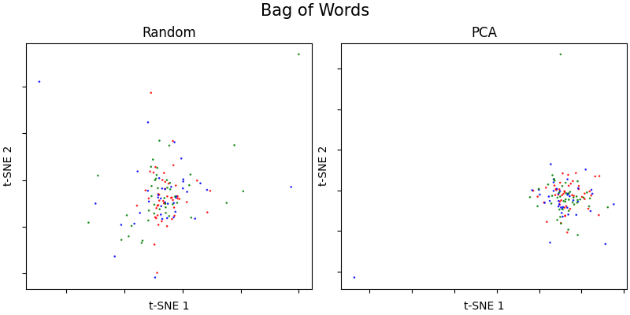
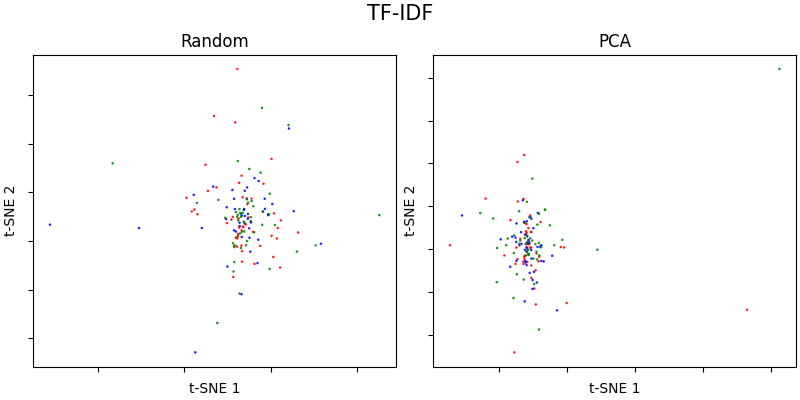
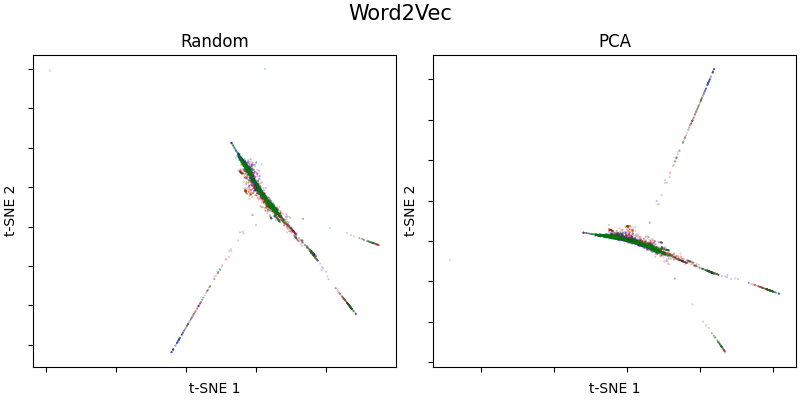
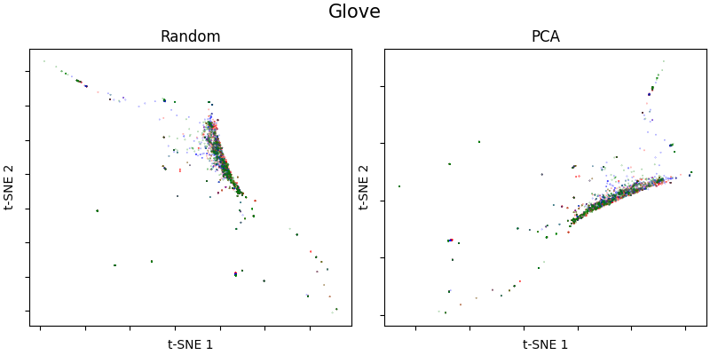
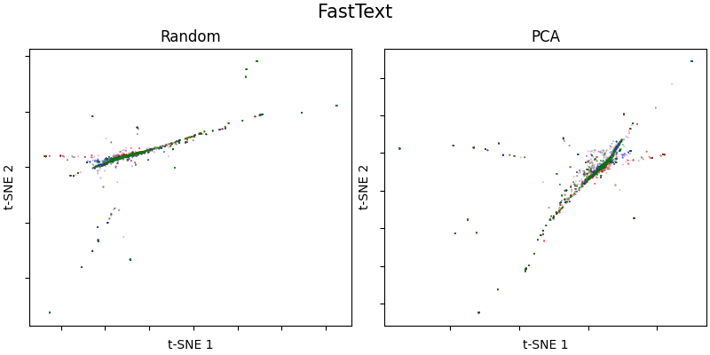
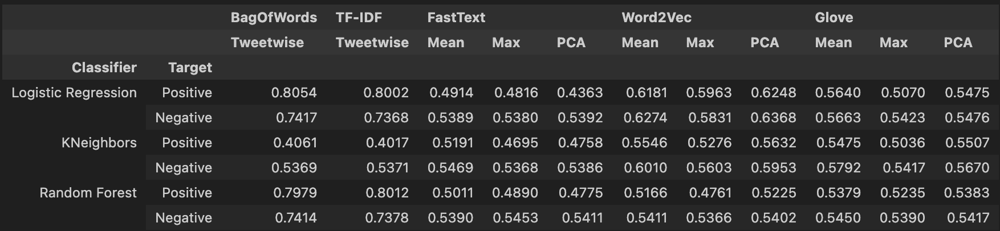

## AI for Global Health using Natural Language Processing

### Part 2: Word Embeddings

**Q1: Bag of Words (2 pts)** <br>

The Bag of Words method establishes the number of occurrences of each word in the dataset and keeps the top n words. The columns of the feature map are then the top n words and the rows are the tweets. Each cell then contains the number of occurrences of the word in the corresponding tweet.

**[Code snippet]**
```
from sklearn.feature_extraction.text import CountVectorizer

vectorizer = CountVectorizer(max_features=1000)
X = vectorizer.fit_transform(data['TweetText']).toarray()
```
We use the count vectorizer of the sklearn library to create the feature map with the Bag of Words method.

**Q2: TF-IDF (2 pts)** <br>

In this method, first for each document (or tweet in our case) we calculate the term frequency ($TF$) of each word in the document. For a given word $w$ and document $d$ the $TF$ score is given by
$$  TF(w, d) = count(w,d) / |d|, $$
where $count(w,d)$ is the number of occurrences of $w$ in $d$ and $|d|$ is the number of words in $d$. The TF score tries to capture the importance of a word in a single document.

The second score of the method is the IDF. Here we first calculate the inverse document frequency for each word in the dataset. That is for each word we divide the number of all documents in the dataset by the total number of documents containing the word. As this inverse score might become very big we apply the logarithm. For a given word $w$ and dataset $D$ the IDF score is given by
$$
\begin{aligned}
IDF(w, D) = log\left(\frac{|D|}{|d \in D : w \in d| + 1}\right),
\end{aligned}
$$
where $|D|$ is the total number of documents and $|d \in D : w \in d|$ is the number of documents containing $w$. In contrast to the $TF$, the $IDF$ measures the importance across documents in the whole dataset.

The final score is then given by combining $TF$ and $IDF$,
$$
TF\text{-}IDF(w, d, D) = TF(w, d) * IDF(w, D).
$$

Again we use the sklearn library to calculate the scores.
In order to get a tractable feature matrix, we again restrict the method to the 1000 words with the highest $TF$ across the whole document. <br>
**[Code snippet]**
```
from sklearn.feature_extraction.text import TfidfVectorizer

vectorizer = TfidfVectorizer(max_features=1000)
X = vectorizer.fit_transform(data['TweetText']).toarray()
```

**Q3: Word2Vec with CBOW or Skip-gram (2 pts)** <br>

Both methods are neural network based approaches to embed a single word in the dataset. CBOW tries to learn this embedding by the context of the words before and after the word we want to embed. While Skip-gram does the opposite, meaning the embedding is learned by predicting the words before and after the word that should be embedded. We decided to go with a pretrained model from hugging-face: "vocab-transformers/distilbert-word2vec_256k-MLM_best" which is a CBOW method. The COBW model is in general faster to train. The neural network in our model is BERT based. (CBOW:  Mikolov, Tomas, et al., <em>  "Advances in pre-training distributed word representations." </em>, 2017). <br> 

**[Code snippet]**
```
import torch
from transformers import AutoModel, AutoTokenizer

w2v = AutoModel.from_pretrained('vocab-transformers/distilbert-word2vec_256k-MLM_best')
w2v_token = AutoTokenizer.from_pretrained('vocab-transformers/distilbert-word2vec_256k-MLM_best')

def get_w2v_embeddings(df,w2v,w2v_token):
    df_out = []
    for t in tqdm(df['TweetText']):
        tokens = w2v_token.tokenize(t)
        token_ids_list = w2v_token.convert_tokens_to_ids(tokens)
        token_ids = torch.tensor([token_ids_list])

        with torch.no_grad():
            tweet_emb = w2v(token_ids)
        df_out.append((token_ids_list,tweet_emb.last_hidden_state.squeeze().numpy()))

    df = pd.DataFrame(df_out, columns=['TokenId','Embeddings'])
    return df
```

**Q4: GloVe (2 pts)** <br>

GloVe relies on the occurrence matrix $V$. This matrix has the words of the vocabulary as rows and columns. Each cell $V_{ij}$ contains the number of times word $i$ has co-occurred with word $j$ in the dataset.

Now we can model the probability of word $i$ occurring with word $j$ as
$$
P_{ij} = \frac{V_{ij}}{V_i},
$$
where $V_i$ is the number of times word $i$ has occurred in the dataset.
Now we introduce two matrices $U, W$ in order to model $P_{ij}$ with
$$
\hat{P}_{ij} = \exp(w_i^T u_j).
$$
So we end up with two vectors $u_i, w_i$ for each word $i$.
The idea is find $U, W$ such that each $\hat{P}_{ij}$ is close to $P_{ij}$.
After applying some further steps, one can then define a loss function for optimizing $U, W$ and some bias $b$. <br>
**[Code snippet]**
```
glove_embeddings = {}
with open("embeddings/glove.twitter.27B.200d.txt", 'r') as f:
    for line in f:
        values = line.split()
        word = values[0]
        vector = np.asarray(values[1:], "float32")
        glove_embeddings[word] = vector
```
**Q5: FastText (2 pts)** <br>

FastText uses a CBOW model to learn word embeddings. But there are several improvements. Position vectors are introduced for each word in the context. In order to encode positional information they are multiplied point wise with each word vector in the surrounding of the source word. Furthermore with certain probability unigrams are merged based on their mutual information. This is done 5-6 times to get more informative phrases. Another feature is the use of subword information. Each word is decomposed into character n-grams and their representations are learned as well. Finally their average is added to the word vector
(Bojanowski et al., <em> Advances in Pre-Training Distributed Word Representations </em>, 2018). <br>

We download a set of word vectors, trained on Wikipedia 2017, UMBC webbase corpus and statmt.org news dataset (16B tokens) from the fasttext website.

**[Code snippet]**
```
import io

def load_vectors(fname):
    fin = io.open(fname, 'r', encoding='utf-8', newline='\n', errors='ignore')
    n, d = map(int, fin.readline().split())
    data = {}
    for line in fin:
        tokens = line.rstrip().split(' ')
        data[tokens[0]] = np.asarray(tokens[1:], dtype=np.float16)
    return data

ft_embeddings = load_vectors('embeddings/wiki-news-300d-1M-subword.vec')
```

**Q6: Visualization of embeddings (2 pts)** <br>

We used t-SNE to do dimensionality reduction, for t-SNE we show both the SVD case, i.e. first SVD is done using 2 PCs and than t-SNE and t-SNE are done. We always show green (positive), blue (neutral), and red (negative) points, where the points are tweets that contain the word "corona". Here we should mention that all word embedding methods (w2v, Glove, FastText) have "corona" in their dictionary. We plotted 50 words of each class and the same words every time.

Bag of Words:

We think that, since the matrix is sparse, it is hard to plot the points in 2D. They are mostly in the same region, yet there are some outliers, which come from tweets with many words, which makes the tweet embedding "larger".

TF-IDF:

The same as we said for the BoW approach. We can see in both BoW and TF-IDF that using PCA as initial input to t-SNE we have drastically reduced the variance of the points.

Word2Vec:

In Word2Vec we can see in both PCA and random initialization that there are spikes and the pictures almost look like they are rotated versions of each other. We think this comes from the approach that word2vec uses and all input dimensions should have the same "importance" and thus a  dimensionality reduction to 2D takes out the same information, disregarding the starting point.

Glove:

Glove in our case produces the most divers t-SNE embeddings. Yet same as in Word2Vec and FastText the most points are very close to the center. We think this is due to many tweets containing the same words, or words that are used often and thus their information gain towards a sentiment is low.

FastText:

The interesting thing here is that the PCA initialization seems to have more variance than the random initialization. In the PCA case, we can see that if the points deviate from the main cluster they are mostly neural or negative.

To predict how the embeddings perform on down stream tasks, it is important to distinguish between the word embedding methods and the tweet embedding methods. The word embeddings have to be further processed because a single vector has relatively low information about the context of the full tweet. While in the tweet embedding approaches it highly depends on which words a tweet contain. This information is lost in the dimensionality reduction and hence we do not get separate clusters. We expect the three word embedding methods to perform similar to each other and the two tweet embedding methods similar to each other. 


**Q7: Tweet embeddings (2 pts)** <br>

We want to combine all word embeddings into an embedding for the full tweet:
1. Taking the mean over all word embeddings in a tweet.
2. Taking the maximum absolute value of each embedding dimension of all words in a tweet.
3. Combing all embeddings into a matrix and only use the first principal component as an embedding.

**[Code snippet]**
```
# 1. aggregate i.e. mean over all words in a tweet
def mean_over_words(df):
    return df['Embeddings'].apply(lambda x: x.mean(axis=0))


# 2. taking the maximum absolute value over all words in a tweet
def maximum_absolute_value(df):
    return df['Embeddings'].apply(lambda x: np.amax(np.abs(x),axis=0))


# 3. Taking the max Principal component as embedding of the n_word x embedding_size
from sklearn.decomposition import TruncatedSVD
def get_PC1(X):
    pca = TruncatedSVD(n_components=1)
    pca.fit(X)
    return pca.components_

def PCA_embedding(df):
   return df['Embeddings'].apply(lambda x: get_PC1(x).squeeze())
```
If we have an Out-of-vocabulary (oov) word we drop the word from the tweet. If all words are oov we drop the tweet completely. This is already done in the per word embedding.


**Q8: Classifier (3 pts)** <br>

Due to computational resources we used the first 30k tweets of our training set to train the classifier and 10k tweets of the validation dataset to validate and 10k of the test set to test.

We trained three classifier for the tweet embeddings: 
1. Logistic Regression Classifier: In LR the learning task is to linearly separate the data and and calculate the percentage to each class and then assign the class with the highest percentage.
2. KNeighbors Classifier: A KNN classifier maps the n (in our case n=5) nearest neighbors (in terms of l2-distance) to a test-sample. After the nearest neighbors are found, a majority vote is performed.
3. Random Forest Classifier: In RF classification n (in our case n=100) decision trees are built and in the end a majority vote is performed.

**[Code snippet]**
```
from sklearn.metrics import f1_score
from sklearn.linear_model import LogisticRegression
from sklearn.neighbors import KNeighborsClassifier
from sklearn.ensemble import RandomForestClassifier

def class(algo, embed, pool=None):

    x_train, y_train_pos, y_train_neg = get_data(embed, 'train',pool)
    x_val, y_val_pos, y_val_neg = get_data(embed, 'val',pool)

    if algo == 'LogReg':
        clf_pos = LogisticRegression(random_state=0, multi_class='multinomial',max_iter=250).fit(x_train, y_train_pos)
        clf_neg = LogisticRegression(random_state=0, multi_class='multinomial',max_iter=250).fit(x_train, y_train_neg)

    elif algo == 'KNN':
        clf_pos = KNeighborsClassifier(n_neighbors=5).fit(x_train, y_train_pos)
        clf_neg = KNeighborsClassifier(n_neighbors=5).fit(x_train, y_train_neg)

    elif algo == 'RF':
        clf_pos = RandomForestClassifier(n_estimators=100).fit(x_train, y_train_pos)
        clf_neg = RandomForestClassifier(n_estimators=100).fit(x_train, y_train_neg)

    y_pred_pos = clf_pos.predict(x_val)
    y_pred_neg = clf_neg.predict(x_val)

    f1_pos = f1_score(y_val_pos,y_pred_pos,average='weighted')
    f1_neg = f1_score(y_val_neg,y_pred_neg,average='weighted')

    return f1_pos, f1_neg, clf_pos, clf_neg


def f1_test(class):    
    f1_scores_log = []
    for embed in ['BagOfWords','TF-IDF','FastText','Word2Vec','Glove']:
        
        pooling = ['Embedding']
        if embed in ['FastText','Word2Vec','Glove']:
            pooling = ['MeanEmbeddings', 'MaxEmbeddings', 'PCAEmbeddings']

        for pool in pooling:
            print(f'{embed} with {pool}')

            val_f1_pos, val_f1_neg, lr_pos, lr_neg = rc_class(embed,pool)
            print(f'Val-Pos: {val_f1_pos:.5f} | Val-Neg: {val_f1_neg:.5f}')

            x_test, y_test_pos, y_test_neg = get_data(embed, 'test', pool)
            y_pred_pos = lr_pos.predict(x_test)
            y_pred_neg = lr_neg.predict(x_test)

            f1_pos = f1_score(y_test_pos,y_pred_pos,average='weighted')
            f1_neg = f1_score(y_test_neg,y_pred_neg,average='weighted')

            f1_scores_log.append([f1_pos,f1_neg])

    return np.array(f1_scores_log)

scores = []
for c in ['LogReg', 'KNN', 'RF']:
    f1 = f1_test(c)
    scores.append(f1)
```

This lead us to the following results:



**Q9: Performance comparison** <br>

The best method for each classifier:

| Classifier                   | Method        | Score  |
|------------------------------|---------------|--------|
| Logistic Regression Positive | Bag of Words  | 0.8054 |
| Logistic Regression Negative | Bag of Words  | 0.7417 |
| KNeighbors Positive          | Word2Vec PCA  | 0.5632 |
| KNeighbors Negative          | Word2Vec Mean | 0.6010 |
| Random Forest Positive       | TF-IDF        | 0.8012 |
| Random Forest Negative       | Bag of Words  | 0.7414 |

We can clearly see that the combination of the words as we proposed in Q8 was not successful and did not yield very good results. We are better than a random classifier, but especially for the KNN classifier we did not get promising results for any of the embedding methods and combination methods. This can be best seen in the logistic regression classifier/Random Forest, where both tweet embedding outperform the word embedding methods by far. Our explanation for this is that the word embedding and combination as we do it fully drop any context of the tweet, where BoW/TF-IDF contain words that are frequent and thus there are words that correspond to a specific sentiment. In the KNN classifier BoW/TF-IDF suffer from the "curse of dimensionality" i.e., the vectors have the same distance to each other and thus these embeddings underperform for the KNN classifier, compared to the word embedding methods.

From a computational point of view the Bag of Words and TF-IDF methods are way more efficient in memory usage. The dictionaries for the FastText/Glove embedding were more than 2GB in both cases and the Word2Vec model is larger than 1GB. After importing the dictionaries/the model the generation of the word to embedding is performed quickly, where for the tweet embeddings we first need to create the embedding scheme which takes at least 4 minutes across the full data set.

In this case we would go for a Logistic Regression classifier and the Bag of Words embedding or the Random Forest classifier with TF-IDF embedding, for two reasons first they perform above average and secondly they are easily explainable and we can see which words the model assigns to which sentiment.


